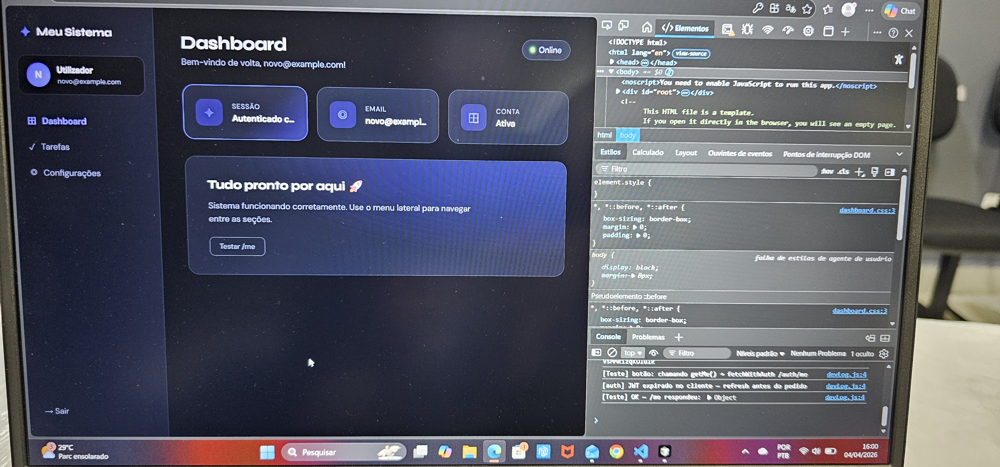

# 🚀 Dashboard com Autenticação JWT (React + FastAPI)

Aplicação fullstack com autenticação completa utilizando JWT (access + refresh token), com interface moderna em tema dark.

---

## 📌 Sobre o projeto

Este projeto simula um sistema real de autenticação e dashboard, incluindo:

- Fluxo completo de login
- Proteção de rotas
- Refresh automático de token
- Integração entre frontend e backend
- Interface moderna com tema dark (lavanda + magenta)

---

## ✨ Funcionalidades

- 🔐 Login com autenticação JWT
- 🔁 Refresh automático do access token
- 🚫 Rotas protegidas (Protected Routes)
- 🚪 Logout funcional
- 📊 Dashboard com informações do usuário
- 🎨 Interface moderna (Dark UI)

---

## 🛠️ Tecnologias utilizada

### Frontend

- React
- React Router
- Fetch API
- CSS customizado (Dark Theme)

### Backend

- FastAPI
- JWT (Access + Refresh Token)
- Python

---

## 🔗 Backend da aplicação

A API utilizada neste projeto está disponível em:

👉 <https://github.com/danieldougtattoo-droid/SEU-REPO-BACKEND>

## 📸 Preview da aplicação

### 🔐 Tela de Login


### 📊 Dashboard



---

## ▶️ Como rodar o projeto

### 🔹 Frontend

```bash
npm install
npm start
```

A aplicação estará disponível em: 👉 <http://localhost:3000>

### 🔹 Backend (FastAPI)

```bash
uvicorn main:app --reload
```

A API estará disponível em: 👉 <http://localhost:8000>

---

## ⚠️ Observações

- Certifique-se de que o backend está rodando antes de iniciar o frontend
- As URLs da API podem ser ajustadas conforme ambiente (.env)

---

## 🤖 Uso de Inteligência Artificial

Este projeto foi desenvolvido com o auxílio de ferramentas de Inteligência Artificial para acelerar a resolução de problemas, estruturar a arquitetura e otimizar o fluxo de desenvolvimento.

Toda a implementação, entendimento da lógica e integração entre frontend e backend foram conduzidos de forma ativa, com foco em aprendizado e aplicação prática dos conceitos.

---

## 📌 Objetivo do projeto

Este projeto foi desenvolvido com foco em:

- Prática de autenticação moderna (JWT)
- Simulação de fluxo real de aplicação
- Construção de interface profissional
- Preparação para uso em portfólio

---

## 👨‍💻 Autor

Desenvolvido por Daniel 🚀
